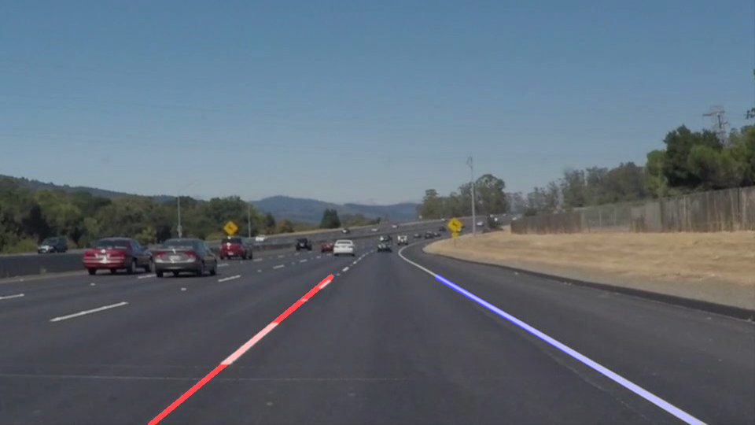

#**Finding Lane Lines on the Road** 

When we drive, we use our eyes to decide where to go.  The lines on the road that show us where the lanes are act as our constant reference for where to steer the vehicle.  Naturally, one of the first things we would like to do in developing a self-driving car is to automatically detect lane lines using an algorithm. In this project we will detect lane lines in images using the Canny Edge Detection and the Hough Transform . See the jupyter notebook for details.  
